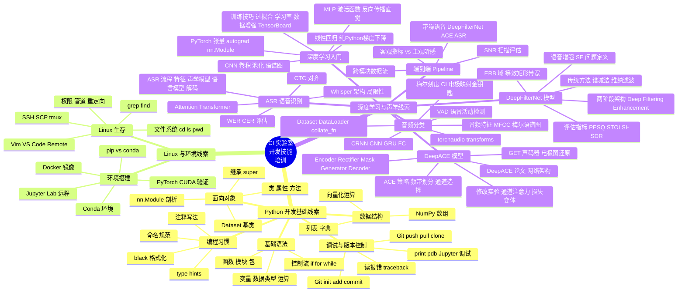
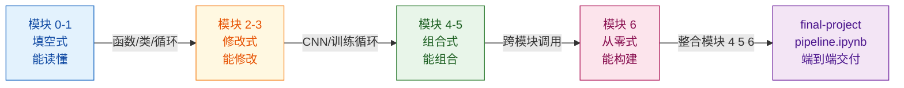
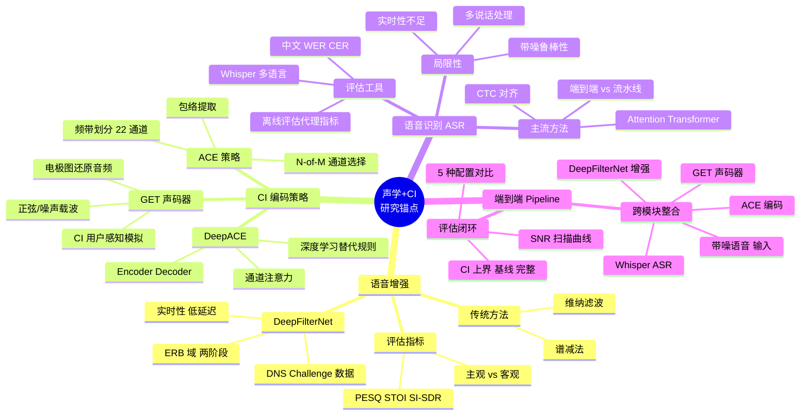

# 《CI/助听器实验室开发技能培训》课程知识图谱

> **课程**：CI/助听器研究实验室开发技能培训
> **总学时**：约 40 学时（16 次课 × 2.5h），8-10 周完成
> **生成时间**：2026-07-13
> **配套文档**：[培训课程指引](readme.md) · [审计报告](AUDIT.md) · [lab-training/README](lab-training/README.md)
> **适用场景**：培训者备课 · 课堂讲授 · 课程评估 · 学生期末复盘
> **培训目标**：从"开发零基础"到"能读懂、能跑通、能改动手中的研究代码"，三个分目标——Python 开发基础、Linux 操作基础、深度学习在声学中的使用

## 目录

1. [课程基本信息](#一课程基本信息)
2. [知识体系总览图](#二知识体系总览图)
3. [编程能力渐进链](#三编程能力渐进链)
4. [模块×学时×主线项目映射](#四模块学时主线项目映射)
5. [研究锚点×模块场景](#五研究锚点模块场景)
6. [主线项目阶段成果图](#六主线项目阶段成果图)
7. [学习路径与复习路径](#七学习路径与复习路径)
8. [核心知识节点详表](#八核心知识节点详表)
9. [综合映射大表](#九综合映射大表)
10. [使用说明](#十使用说明)

---

## 一、课程基本信息

| 项目 | 内容 |
|------|------|
| 课程名称 | CI/助听器实验室开发技能培训 |
| 课程性质 | 实验室内部培训（非学分课程） |
| 考核方式 | 过程性（课后任务提交）+ 终结性（pipeline 演示 + 技术报告） |
| 总学时 | 约 40 学时（16 次课 × 2.5h），8-10 周完成 |
| 授课对象 | CI/助听器研究实验室本科生、硕士研究生 |
| 先修要求 | 高等数学、信号与系统（物理/光电背景学生数学基础好但编程思维弱） |
| 实验环境 | 课上租用 GPU 服务器（AutoDL/恒源云）+ 课后 Colab + 本地笔记本 |
| 授课模式 | "15 分钟讲授 + 10 分钟实操 + 循环"，每节课必有"独立编写"环节 |
| 课程结构 | 模块 0-6 共 7 个模块、16 次课、14 个 notebook + 1 个 pipeline.ipynb |
| 编程能力四阶段 | 能读懂 → 能修改 → 能组合 → 能构建 |
| 贯穿主线项目 | CI 语音增强与识别 Pipeline（带噪语音 → DeepFilterNet → ACE → ASR） |
| 配套代码 | `lab-training/` 仓库，每个模块含 notebooks/ + exercises/ + 预习材料 |

### 1.1 学情分析三特征

本课程不照搬计算机学院的深度学习课程，基于三个学情特征设计：

| 特征 | 含义 | 教学应对 |
|------|------|---------|
| 物理/光电背景，数学基础好但编程思维弱 | 理解卷积数学定义，但不知道"卷积层在代码里长什么样" | 反复画"数学公式 → 代码实现"的桥梁 |
| 研究导向，非工程导向 | 学 DL 是为读懂论文、复现实验、修改模型，不是上生产 | 重心在"理解架构、读懂代码、调整实验"，而非"部署、优化" |
| 经验跨度大 | 有的本科生没摸过命令行，有的硕士生用过 Python | 每次课分层设计——基础路径 + 进阶任务 |

### 1.2 七条核心原则

| 原则 | 内容 |
|------|------|
| 一、领域锚定 | 每个技术概念都用声音/CI 场景引入——不用 MNIST，用 ESC-50；不用 ImageNet，用语音帧 |
| 二、先动手后理解 | 先跑通代码看结果，再讲原理。顺序是"现象 → 问题 → 原理" |
| 三、螺旋上升 | 同一概念（卷积、损失、梯度）在不同模块以不同深度反复出现 |
| 四、渐进式项目 | 从第 1 节课开始有贯穿主线项目，每节课推进一步 |
| 五、降低挫败感阈值 | 环境配置是头号杀手，模块 1 必须彻底解决——预配置 Docker + Conda |
| 六、编程能力渐进培养 | 填空式 → 修改式 → 组合式 → 从零式，每模块至少一个"独立编写"环节 |
| 七、计算资源双轨制 | 课上租用 GPU 服务器 + 课后 Colab 免费 GPU + 本地笔记本 |

### 1.3 三个培训目标与达成度

| 目标 | 修复前状态 | 修复后状态 | 主要承载模块 |
|------|----------|----------|------------|
| Python 开发基础 | 部分可达（编程练习被预填答案架空） | 大部分可达（7 个 notebook 拆学生/solution 版） | 模块 0 |
| Linux 操作基础 | 基本可达 | 基本可达（cell 31 验证补真实读 wav） | 模块 1 |
| 深度学习在声学中的使用 | 严重不足（假 pipeline + 权重缺失） | 部分可达（pipeline 已跑通 + Wiener 冒充已换真实 DFN，权重仍待补） | 模块 2-6 |

---

## 二、知识体系总览图

> **视图目的**：一眼看全课程知识版图，3 条主线并行展开。
> **受众**：全部受众（培训者/学生/评估者）
> **颗粒度**：中粒度（约 40 个节点）
> **下钻**：详见表 [八、核心知识节点详表](#八核心知识节点详表)



---

## 三、编程能力渐进链

> **视图目的**：呈现"填空→修改→组合→从零"四阶段渐进逻辑，作为课程核心配图。
> **受众**：全部受众
> **配套**：原则六"编程能力渐进培养"



### 3.1 渐进逻辑要点

| 阶段 | 教学要求 | 课堂形式 | 学生交付 |
|------|---------|---------|---------|
| 填空式 | 给出框架，填关键代码 | TODO + scaffolding | 改完 TODO 跑通 |
| 修改式 | 在已有代码上改功能/参数 | 给数据流图，学生查 API 写代码 | 改变超参数或网络层 |
| 组合式 | 用已有模块拼出新功能 | 给输入输出规格 | 拼出 Dataset+Model+训练循环 |
| 从零式 | 独立设计并实现小项目 | 只给任务描述 | 完整可运行的 pipeline |

### 3.2 学生版 + solution 版双轨设计

| Notebook | 学生版 | Solution 版 |
|----------|--------|------------|
| module 0 nb01 (basics-signal) | 9 个 TODO → raise NotImplementedError | 同目录完整代码 |
| module 0 nb02 (oop-audio) | 6 个 TODO → raise NotImplementedError | 同目录完整代码 |
| module 2 nb02 (mlp-pytorch) | 3 个 TODO → raise NotImplementedError | 同目录完整代码 |
| module 2 nb03 (cnn-audio) | 2 个 TODO → raise NotImplementedError | 同目录完整代码 |
| module 2 nb04 (training-tricks) | train_model 注释框架 + 末尾隐藏附录 | 同目录完整代码 |
| module 3 nb02 (crnn-classifier) | 5 个预填 cell 注释框架 + 末尾附录 | 同目录完整代码 |

---

## 四、模块×学时×主线项目映射

> **视图目的**：直观呈现 7 个模块 16 次课的节奏与主线项目推进。
> **受众**：培训者备课、课程评估
> **数据校验源**：[readme.md §四时间规划](readme.md)

```mermaid
flowchart TB
  subgraph 模块0["模块 0 Python 基础 3次 7.5h"]
    W1A["第1次<br/>基础语法 + 信号生成"]
    W1B["第2次<br/>面向对象 + AudioDataset"]
    W1C["第3次<br/>调试 Git + 编程习惯"]
  end
  subgraph 模块1["模块 1 Linux + 环境 2次 5h"]
    W2A["第1次<br/>Linux 生存"]
    W2B["第2次<br/>环境搭建"]
  end
  subgraph 模块2["模块 2 DL 入门 3次 7.5h"]
    W3A["第1次<br/>线性回归 + MLP"]
    W3B["第2次<br/>CNN + 语谱图"]
    W3C["第3次<br/>训练技巧"]
  end
  subgraph 模块3["模块 3 音频分类 3次 7.5h"]
    W4A["第1次<br/>音频特征 MFCC"]
    W4B["第2次<br/>CRNN 分类器"]
    W4C["第3次<br/>CI 相关任务"]
  end
  subgraph 模块4["模块 4 DeepACE 2-3次 5-7.5h"]
    W5A["第1次<br/>ACE 论文精读"]
    W5B["第2次<br/>代码解析"]
    W5C["第3次可选<br/>修改实验"]
  end
  subgraph 模块5["模块 5 DeepFilterNet 2-3次 5-7.5h"]
    W6A["第1次<br/>SE 基础 + 论文"]
    W6B["第2次<br/>代码解析"]
    W6C["第3次可选<br/>CI 整合"]
  end
  subgraph 模块6["模块 6 ASR 2次 5h"]
    W7A["第1次<br/>ASR 原理"]
    W7B["第2次<br/>Whisper + Pipeline 整合"]
  end

  模块0 --> 模块1 --> 模块2 --> 模块3 --> 模块4 --> 模块5 --> 模块6

  classDef mod0 fill:#E3F2FD,stroke:#1565C0
  classDef mod1 fill:#FFF8E1,stroke:#F57F17
  classDef mod2 fill:#E8F5E9,stroke:#2E7D32
  classDef mod3 fill:#FFE0B2,stroke:#E65100
  classDef mod4 fill:#FCE4EC,stroke:#AD1457
  classDef mod5 fill:#E1BEE7,stroke:#6A1B9A
  classDef mod6 fill:#B2DFDB,stroke:#00695C

  class 模块0 mod0
  class 模块1 mod1
  class 模块2 mod2
  class 模块3 mod3
  class 模块4 mod4
  class 模块5 mod5
  class 模块6 mod6
```



### 4.1 16 次课完整映射表

| 模块 | 次序 | 主题 | 学时 | 编程能力目标 | 主线项目进度 |
|------|------|------|------|-------------|------------|
| 模块 0 | 第 1 次 | Python 基础——从计算器到程序 | 2.5h | 能读懂 | 能写基本数据处理脚本 |
| 模块 0 | 第 2 次 | Python 进阶——面向对象与代码组织 | 2.5h | 能读懂 | 理解函数、类、模块 |
| 模块 0 | 第 3 次 | 调试、版本控制与编程习惯 | 2.5h | 能读懂 | Git 提交代码 |
| 模块 1 | 第 1 次 | Linux 生存指南 | 2.5h | 能读懂 | Linux 上运行 Python |
| 模块 1 | 第 2 次 | 深度学习环境搭建 | 2.5h | 能读懂 | 环境就绪 |
| 模块 2 | 第 1 次 | 从感知机到神经网络 | 2.5h | 能修改 | 训练语音/噪声二分类 |
| 模块 2 | 第 2 次 | CNN 与声音的"图像化" | 2.5h | 能修改 | CNN 语谱图分类 |
| 模块 2 | 第 3 次 | 训练技巧与实验方法论 | 2.5h | 能修改 | TensorBoard 记录 |
| 模块 3 | 第 1 次 | 音频特征工程与经典方法 | 2.5h | 能修改→能组合 | 提取梅尔语谱图 |
| 模块 3 | 第 2 次 | 音频分类模型搭建 | 2.5h | 能组合 | CRNN ESC-50 分类 |
| 模块 3 | 第 3 次 | CI 相关音频分类实战 | 2.5h | 能组合 | VAD 模型 |
| 模块 4 | 第 1 次 | ACE 策略 + DeepACE 论文精读 | 2.5h | 能组合 | 理解 ACE 编码 |
| 模块 4 | 第 2 次 | DeepACE 代码解析与运行 | 2.5h | 能组合 | 运行 DeepACE 推理 |
| 模块 4 | 第 3 次 | DeepACE 修改实验（可选） | 2.5h | 能组合 | 设计修改方案 |
| 模块 5 | 第 1 次 | 语音增强 + DeepFilterNet 论文 | 2.5h | 能组合 | 理解 SE 架构 |
| 模块 5 | 第 2 次 | DeepFilterNet 代码解析与运行 | 2.5h | 能组合 | 运行 SE 推理 |
| 模块 5 | 第 3 次 | DeepFilterNet + CI 整合（可选） | 2.5h | 能组合 | 增强→ACE pipeline |
| 模块 6 | 第 1 次 | ASR 原理与主流方法 | 2.5h | 能构建 | 理解 ASR 流程 |
| 模块 6 | 第 2 次 | ASR 实战 + 端到端 Pipeline 整合 | 2.5h | 能构建 | **完整 pipeline 跑通** |

---

## 五、研究锚点×模块场景

> **视图目的**：突出课程"声学 + CI"领域锚定，便于实验室研究方向对接。
> **受众**：培训者备课、评估者
> **数据校验源**：[readme.md §一学情分析 + 各模块设计](readme.md)



### 5.1 研究锚点 × 模块统计

| 锚点 | 涉及模块 | 关键技能 |
|------|---------|---------|
| 语音增强 | 模块 5 | DeepFilterNet 推理、PESQ/STOI/SI-SDR 评估 |
| CI 编码策略 | 模块 4 | ACE/DeepACE、GET 声码器、电极图可视化 |
| 语音识别 ASR | 模块 6 | Whisper 推理、CER 计算、局限性理解 |
| 端到端 Pipeline | 模块 4/5/6 + final-project | 跨模块数据流、graceful fallback、SNR 扫描 |
| 音频特征工程 | 模块 3 | MFCC、梅尔语谱图、torchaudio.transforms |
| 深度学习基础 | 模块 2 | MLP、CNN、训练循环、TensorBoard |

---

## 六、主线项目阶段成果图

> **视图目的**：呈现贯穿课程的"CI 语音增强与识别 Pipeline"如何随模块推进。
> **受众**：全部受众
> **数据校验源**：[final-project/README.md](lab-training/final-project/README.md) + [pipeline.ipynb](lab-training/final-project/pipeline.ipynb)

```mermaid
flowchart LR
  Start(["带噪语音<br/>原始输入"]) --> M0["模块 0<br/>Python 脚本"]
  M0 --> M1["模块 1<br/>Linux 上运行"]
  M1 --> M2["模块 2<br/>语音/噪声 CNN"]
  M2 --> M3["模块 3<br/>CRNN ESC-50 分类"]
  M3 --> M4["模块 4<br/>DeepACE 推理<br/>电极图"]
  M4 --> M5["模块 5<br/>DeepFilterNet 增强<br/>SI-SDR 评估"]
  M5 --> M6["模块 6<br/>Whisper ASR<br/>CER 评估"]
  M6 --> Final(["完整 Pipeline<br/>带噪→增强→编码→识别"])

  Final --> Eval["5 种配置对比<br/>SNR 扫描<br/>技术报告"]

  classDef stage fill:#E3F2FD,stroke:#1565C0,color:#0D47A1
  classDef final fill:#C8E6C9,stroke:#2E7D32,color:#1B5E20
  classDef eval fill:#FFF8E1,stroke:#F57F17,color:#E65100

  class M0,M1,M2,M3,M4,M5,M6 stage
  class Final final
  class Eval eval
```



### 6.1 主线项目最终架构

```
┌──────────┐   ┌──────────────┐   ┌──────────┐   ┌──────────┐   ┌──────────┐
│ 带噪语音 │ → │ DeepFilterNet │ → │   ACE    │ → │ GET声码器 │ → │  Whisper  │ → 文本
│ (输入)   │   │  语音增强     │   │ CI编码   │   │ 语音还原  │   │  ASR识别 │
└──────────┘   └──────────────┘   └──────────┘   └──────────┘   └──────────┘
   原始音频       增强音频           电极图         还原音频        识别文本
                 (模块5)           (模块4)         (模块4)         (模块6)
```

### 6.2 五种配置对比实验

| 配置 | 流程 | 含义 |
|------|------|------|
| A: clean → ASR | 无处理 | 上界参考 |
| B: noisy → ASR | 无处理 | 基线 |
| C: enhanced → ASR | 仅语音增强 | 增强效果 |
| D: enhanced → ACE → vocoder → ASR | 完整 CI pipeline | CI 用户感知模拟 |
| E: clean → ACE → vocoder → ASR | CI 处理上界 | 无增强无噪声 |

---

## 七、学习路径与复习路径

> **视图目的**：给学生提供推荐学习/复习顺序，标注关键节点。
> **受众**：学生期末复盘、新学员入门
> **优先级规则**：★★★★★ 必修核心 · ★★★★ 重要 · ★★★ 了解 · ★★ 扩展


### 7.1 复习要点速查

| 模块 | 必背概念/公式 | 关键技能 |
|------|-------------|---------|
| 模块 0 | 函数定义、类继承、`super().__init__()` | 写一个 Signal 类 |
| 模块 1 | `ssh`、`tmux`、`conda activate`、`torch.cuda.is_available()` | 服务器上跑通 notebook |
| 模块 2 | `y = σ(Wx + b)`、卷积输出尺寸、过拟合曲线 | 训练 MLP/CNN 看 loss 下降 |
| 模块 3 | 梅尔刻度 ↔ CI 电极映射、CRNN 数据流 `[B, T, C*F]` | 提取梅尔语谱图、搭 CRNN |
| 模块 4 | ACE N-of-M 通道选择、DeepACE Encoder-Decoder | 加载预训练权重跑推理 |
| 模块 5 | ERB 域、PESQ/STOI/SI-SDR 区别、两阶段架构 | DeepFilterNet 增强评估 |
| 模块 6 | WER/CER、CTC 对齐、Whisper 局限性 | Whisper 推理、端到端 pipeline |
| final | pipeline 数据流、graceful fallback、5 种配置对比 | 跑通完整闭环、写报告 |

### 7.2 关键 API 速查

| 任务 | API |
|------|-----|
| 音频加载 | `torchaudio.load`、`soundfile.read` |
| 梅尔语谱图 | `T.MelSpectrogram`、`T.AmplitudeToDB` |
| Dataset | `torch.utils.data.Dataset`、`__len__`、`__getitem__` |
| 训练循环 | `model.train()`、`optimizer.zero_grad()`、`loss.backward()`、`optimizer.step()` |
| 验证 | `model.eval()`、`with torch.no_grad():` |
| DeepFilterNet | `from df.enhance import init_df, enhance` |
| ACE | `from ace_strategy import ace_strategy` |
| GET 声码器 | `from get_voc import get_voc` |
| Whisper | `whisper.load_model`、`model.transcribe` |

---

## 八、核心知识节点详表

> **视图目的**：图二总览图的下钻版本，提供细粒度叶节点 + 关键 API + 模块定位。
> **受众**：培训者备课
> **组织方式**：按 3 条线索分 3 个子表
> **优先级规则**：★★★★★ 必修核心 · ★★★★ 重要 · ★★★ 了解 · ★★ 扩展

### 8.1 Python 开发基础线索

| 模块 | 子主题 | 叶节点 | 关键概念/API | 课时 | 考点 |
|------|--------|--------|--------------|------|------|
| 模块 0 | 基础语法 | 变量类型运算 | `int/float/str/bool`、NumPy 向量化 | 第 1 次 | ★★★★★ |
| 模块 0 | 基础语法 | 控制流 | `if/for/while`、生成正弦波 | 第 1 次 | ★★★★ |
| 模块 0 | 基础语法 | 函数 | `def`、参数、返回值、`generate_sine_wave` | 第 1 次 | ★★★★★ |
| 模块 0 | 基础语法 | 列表字典 | `[...]`、`{...}`、wav 元数据 | 第 1 次 | ★★★ |
| 模块 0 | 面向对象 | 类定义 | `class`、`__init__`、`self` | 第 2 次 | ★★★★★ |
| 模块 0 | 面向对象 | 继承 | `class Sub(Base)`、`super().__init__()` | 第 2 次 | ★★★★ |
| 模块 0 | 面向对象 | nn.Module | PyTorch 源码剖析、`forward` 方法 | 第 2 次 | ★★★★ |
| 模块 0 | 面向对象 | Dataset 基类 | `__len__`、`__getitem__`、AudioDataset | 第 2 次 | ★★★★★ |
| 模块 0 | 调试 | print 调试 | 跟踪张量形状 | 第 3 次 | ★★★ |
| 模块 0 | 调试 | pdb | `set_trace()`、`n/s/c/p` 命令 | 第 3 次 | ★★ |
| 模块 0 | 调试 | Jupyter 调试 | `%debug`、`set_trace()` | 第 3 次 | ★★ |
| 模块 0 | Git | 本地操作 | `init/add/commit/status/log` | 第 3 次 | ★★★★ |
| 模块 0 | Git | 远程协作 | `push/pull/clone/remote add` | 第 3 次 | ★★★★ |
| 模块 0 | Git | 推送本地文件夹 | `init→add→commit→branch -M main→remote add→push -u` | 第 3 次 | ★★★ |
| 模块 0 | 编程习惯 | 命名规范 | 好名字 vs 坏名字 | 第 3 次 | ★★ |
| 模块 0 | 编程习惯 | black | 代码格式化 | 第 3 次 | ★★ |
| 模块 0 | 编程习惯 | type hints | `def f(a: int) -> int:`、`Optional`、`list[int]` | 第 3 次 | ★★★ |
| 模块 1 | Linux 生存 | 文件系统 | `cd/ls/pwd/mkdir/rm/cp/mv/cat/less` | 第 1 次 | ★★★★★ |
| 模块 1 | Linux 生存 | 管道重定向 | `|`、`>`、`grep`、`find` | 第 1 次 | ★★★★ |
| 模块 1 | Linux 生存 | SSH/SCP | 远程登录、文件传输 | 第 1 次 | ★★★★ |
| 模块 1 | Linux 生存 | tmux | 后台运行、断连不中断 | 第 1 次 | ★★★★ |
| 模块 1 | Linux 生存 | Vim/VS Code | 配置文件修改、Remote 开发 | 第 1 次 | ★★★ |
| 模块 1 | 环境搭建 | Conda | `env create/activate/install/export` | 第 2 次 | ★★★★ |
| 模块 1 | 环境搭建 | PyTorch CUDA | `torch.cuda.is_available()` | 第 2 次 | ★★★★ |
| 模块 1 | 环境搭建 | Docker | 预配置镜像、`docker run --gpus all` | 第 2 次 | ★★★ |
| 模块 1 | 环境搭建 | Jupyter 远程 | SSH 端口转发、`--port 8888` | 第 2 次 | ★★★ |

### 8.2 深度学习入门线索

| 模块 | 子主题 | 叶节点 | 关键概念/API | 课时 | 考点 |
|------|--------|--------|--------------|------|------|
| 模块 2 | 线性回归 | 纯 Python 梯度下降 | `w -= lr * grad`、特征归一化 | 第 1 次 | ★★★★ |
| 模块 2 | 线性回归 | PyTorch 重写 | `nn.Linear`、`SGD`、autograd | 第 1 次 | ★★★★ |
| 模块 2 | MLP | 激活函数 | ReLU = 半波整流、响度感知类比 | 第 1 次 | ★★★★ |
| 模块 2 | MLP | 反向传播直觉 | 误差信号回传，不推链式法则 | 第 1 次 | ★★★ |
| 模块 2 | MLP | 正弦波分类 | 200/800Hz、500 样本、10 秒收敛 | 第 1 次 | ★★★★ |
| 模块 2 | CNN | 语谱图枢纽 | 横轴时间、纵轴频率、颜色能量 | 第 2 次 | ★★★★★ |
| 模块 2 | CNN | 梅尔刻度 | 模拟人耳、CI 电极映射 | 第 2 次 | ★★★★ |
| 模块 2 | CNN | 卷积池化 | `nn.Conv2d`、`MaxPool2d`、感受野 | 第 2 次 | ★★★★ |
| 模块 2 | CNN | 语音 vs 噪声分类 | SpeechNoiseDataset、3 层 CNN | 第 2 次 | ★★★★ |
| 模块 2 | 训练技巧 | 过拟合 | 训练集小看 10 样本实验 | 第 3 次 | ★★★★ |
| 模块 2 | 训练技巧 | 学习率 | 太大震荡、太小不动 | 第 3 次 | ★★★★ |
| 模块 2 | 训练技巧 | 数据增强 | SpecAugment、频谱掩蔽 | 第 3 次 | ★★★ |
| 模块 2 | 训练技巧 | TensorBoard | `SummaryWriter`、实验记录 | 第 3 次 | ★★★ |
| 模块 2 | 训练技巧 | 训练循环 | 注释框架、四步：前向→损失→反向→更新 | 第 3 次 | ★★★★★ |

### 8.3 深度学习与声学线索

| 模块 | 子主题 | 叶节点 | 关键概念/API | 课时 | 考点 |
|------|--------|--------|--------------|------|------|
| 模块 3 | 音频特征 | MFCC 全流程 | 预加重→分帧→FFT→梅尔滤波→对数→DCT | 第 1 次 | ★★★★ |
| 模块 3 | 音频特征 | 梅尔语谱图 | `T.MelSpectrogram`、`T.AmplitudeToDB` | 第 1 次 | ★★★★★ |
| 模块 3 | 音频特征 | 梅尔-电极映射 | CI 22 通道、频率分配金钥匙 | 第 1 次 | ★★★★★ |
| 模块 3 | 音频特征 | torchaudio.transforms | 完整变换管线 | 第 1 次 | ★★★★ |
| 模块 3 | CRNN | Dataset/DataLoader | `collate_fn`、变长 padding | 第 2 次 | ★★★★★ |
| 模块 3 | CRNN | CNN 部分 | Conv2d + BatchNorm + ReLU + MaxPool2d | 第 2 次 | ★★★★ |
| 模块 3 | CRNN | GRU 部分 | 双向、`batch_first=True`、`gather` 取最后帧 | 第 2 次 | ★★★★ |
| 模块 3 | CRNN | 评估 | 混淆矩阵、`classification_report` | 第 2 次 | ★★★ |
| 模块 3 | CI 任务 | VAD | 语音活动检测、ACE 通道选择对应 | 第 3 次 | ★★★ |
| 模块 3 | CI 任务 | 可懂度分类 | 带噪语音可懂/不可懂 | 第 3 次 | ★★★ |
| 模块 3 | CI 任务 | 调优 | lr range test、混合精度、梯度累积 | 第 3 次 | ★★★ |
| 模块 4 | ACE | 频带划分 | 22 通道、梅尔刻度 | 第 1 次 | ★★★★ |
| 模块 4 | ACE | N-of-M 通道选择 | 每帧选 N 个最大幅度通道 | 第 1 次 | ★★★★ |
| 模块 4 | DeepACE | 论文精读 | Figure 1 架构、训练数据构造 | 第 1 次 | ★★★★ |
| 模块 4 | DeepACE | 代码结构 | Encoder/Rectifier/Mask Generator/Decoder | 第 2 次 | ★★★★ |
| 模块 4 | DeepACE | 数据流 | `[B, 1, 64000] → [B, 22, 4000]` | 第 2 次 | ★★★★ |
| 模块 4 | DeepACE | 预训练推理 | `load_state_dict`、`best_model.pth` | 第 2 次 | ★★★★ |
| 模块 4 | GET 声码器 | 电极图还原 | `get_voc()`、正弦载波、CI 模拟 | 第 2 次 | ★★★ |
| 模块 4 | 修改实验 | 通道注意力 | `ChannelAttention` 模块 | 第 3 次 | ★★★ |
| 模块 4 | 修改实验 | 损失变体 | `WeightedChannelMSE`、`SparseMSE` | 第 3 次 | ★★★ |
| 模块 4 | 修改实验 | SNR 扫描 | 不同噪声条件评估 | 第 3 次 | ★★★ |
| 模块 5 | SE 基础 | 问题定义 | 带噪→干净、CI 用户场景动机 | 第 1 次 | ★★★★ |
| 模块 5 | SE 基础 | 评估指标 | PESQ、STOI、SI-SDR 局限性 | 第 1 次 | ★★★★ |
| 模块 5 | SE 基础 | 传统方法 | 谱减法、维纳滤波 | 第 1 次 | ★★★ |
| 模块 5 | DeepFilterNet | ERB 域 | 等效矩形带宽、听觉感知 | 第 1 次 | ★★★★ |
| 模块 5 | DeepFilterNet | 两阶段架构 | Deep Filtering + Enhancement | 第 1 次 | ★★★★ |
| 模块 5 | DeepFilterNet | 代码解析 | `init_df`、`enhance`、ERB vs 梅尔 | 第 2 次 | ★★★★ |
| 模块 5 | DeepFilterNet | 真实推理 | 48k↔16k 重采样、预训练权重 | 第 2 次 | ★★★★ |
| 模块 5 | CI 整合 | ERB 频带数 | 改 NB_ERB 对应 CI 电极数 | 第 3 次 | ★★★ |
| 模块 5 | CI 整合 | Enhance→Encode | DFN 输出送入 ACE | 第 3 次 | ★★★★ |
| 模块 5 | CI 整合 | 延迟分析 | 实时性评估、助听器要求 | 第 3 次 | ★★★ |
| 模块 6 | ASR 原理 | WER/CER | 编辑距离、字符错误率 | 第 1 次 | ★★★★ |
| 模块 6 | ASR 原理 | CTC | 帧对齐、blank 折叠 | 第 1 次 | ★★★ |
| 模块 6 | ASR 原理 | Attention/Transformer | Q/K/V、自注意力 | 第 1 次 | ★★★ |
| 模块 6 | ASR 原理 | Whisper 架构 | 多语言、Encoder-Decoder | 第 1 次 | ★★★ |
| 模块 6 | ASR 原理 | Whisper 局限性 | 中文 CER、带噪、实时性 | 第 1 次 | ★★★★ |
| 模块 6 | Whisper 实战 | 推理 API | `whisper.load_model`、`transcribe` | 第 2 次 | ★★★★ |
| 模块 6 | Whisper 实战 | 噪声影响 | clean vs noisy WER 对比 | 第 2 次 | ★★★★ |
| 模块 6 | Pipeline 整合 | 端到端闭环 | 带噪→DFN→ACE→声码器→ASR | 第 2 次 | ★★★★★ |
| 模块 6 | Pipeline 整合 | 5 种配置 | 上界/基线/仅增强/完整/CI 上界 | 第 2 次 | ★★★★ |
| final | Pipeline | 跨模块调用 | DFN + ACE + Whisper 真实串联 | 交付 | ★★★★★ |
| final | Pipeline | graceful fallback | DFN→Wiener、Whisper→跳过 | 交付 | ★★★ |
| final | Pipeline | SNR 扫描 | -5/0/5/10/20 dB CER 曲线 | 交付 | ★★★★ |
| final | 报告 | 技术报告 | 各模块作用、参数选择、结果分析 | 交付 | ★★★★ |

---

## 九、综合映射大表

> **视图目的**：一行一节课，整合 模块次序 + 学时 + 编程能力 + 主线进度 + 关键 API，单一真相源。
> **受众**：培训者备课
> **组织方式**：19 行按模块次序排序
> **配套文档**：[lab-training/README.md](lab-training/README.md)

| 模块 | 次序 | 主题 | 学时 | 编程能力 | 主线进度 | 关键 API/概念 | 配套 notebook |
|------|------|------|------|---------|---------|--------------|---------------|
| 0 | 1 | Python 基础 | 2.5h | 读懂 | 数据处理脚本 | 变量/控制流/函数 | `01-basics-signal.ipynb` |
| 0 | 2 | OOP 与代码组织 | 2.5h | 读懂 | 理解类/模块 | `class`/`super`/nn.Module | `02-oop-audio.ipynb` |
| 0 | 3 | 调试 Git 习惯 | 2.5h | 读懂 | Git 提交 | pdb/Git/black/type hints | `03-debugging-git.ipynb` |
| 1 | 1 | Linux 生存 | 2.5h | 读懂 | Linux 运行 Python | cd/ls/SSH/tmux/Vim | `01-linux-survival.ipynb` |
| 1 | 2 | 环境搭建 | 2.5h | 读懂 | 环境就绪 | Conda/PyTorch/Docker | `02-environment-setup.ipynb` |
| 2 | 1 | 感知机到神经网络 | 2.5h | 修改 | 语音/噪声二分类 | nn.Linear/MLP/autograd | `01-linear-regression.ipynb`、`02-mlp-pytorch.ipynb` |
| 2 | 2 | CNN 与语谱图 | 2.5h | 修改 | CNN 语谱图分类 | Conv2d/MelSpectrogram | `03-cnn-audio.ipynb` |
| 2 | 3 | 训练技巧 | 2.5h | 修改 | TensorBoard 记录 | 过拟合/lr/SpecAugment | `04-training-tricks.ipynb` |
| 3 | 1 | 音频特征 | 2.5h | 修改→组合 | 提取梅尔语谱图 | MFCC/梅尔-电极映射 | `01-audio-features.ipynb` |
| 3 | 2 | CRNN 分类器 | 2.5h | 组合 | CRNN ESC-50 分类 | Dataset/CRNN/collate_fn | `02-crnn-classifier.ipynb` |
| 3 | 3 | CI 相关实战 | 2.5h | 组合 | VAD 模型 | VAD/可懂度/混合精度 | `03-ci-tasks.ipynb` |
| 4 | 1 | ACE 论文精读 | 2.5h | 组合 | 理解 ACE 编码 | ACE N-of-M/DeepACE 论文 | `01-ace-and-paper.ipynb` |
| 4 | 2 | DeepACE 代码 | 2.5h | 组合 | 运行 DeepACE 推理 | Encoder/GET 声码器 | `02-code-analysis.ipynb` |
| 4 | 3 | 修改实验（可选） | 2.5h | 组合 | 设计修改方案 | 通道注意力/损失变体 | `03-modification-experiments.ipynb` |
| 5 | 1 | SE + DeepFilterNet 论文 | 2.5h | 组合 | 理解 SE 架构 | PESQ/STOI/ERB | `01-se-enhancement-basics.ipynb` |
| 5 | 2 | DeepFilterNet 代码 | 2.5h | 组合 | 运行 SE 推理 | init_df/enhance | `02-code-analysis.ipynb` |
| 5 | 3 | CI 整合（可选） | 2.5h | 组合 | 增强→ACE pipeline | ERB 频带/Enhance→Encode | `03-ci-integration.ipynb` |
| 6 | 1 | ASR 原理 | 2.5h | 构建 | 理解 ASR 流程 | WER/CER/CTC/Whisper | `01-asr-principles.ipynb` |
| 6 | 2 | Whisper + Pipeline | 2.5h | 构建 | **完整 pipeline 跑通** | Whisper/5 种配置/SNR 扫描 | `02-whisper-pipeline.ipynb` |
| final | — | 主线项目交付 | 课外 | 构建 | **端到端闭环 + 报告** | DFN+ACE+Whisper/graceful fallback | `final-project/pipeline.ipynb` |

### 9.1 统计校验

| 维度 | 数量 |
|------|------|
| 总课时 | 16 次 × 2.5h = 40h（不含可选第 3 次课） |
| 模块数 | 7 个（模块 0-6） |
| 配套 notebook | 14 个 + 1 个 pipeline.ipynb + 6 个 solution 版 |
| 编程能力阶段 | 4 个（读懂/修改/组合/构建） |
| 主线项目阶段 | 8 个（模块 0-6 各一个 + final 交付） |
| 学生版独立编写环节 | 7 个 notebook（含 TODO 或注释框架） |

---

## 十、使用说明

### 10.1 各视图的受众与使用场景

| 章节 | 视图 | 培训者备课 | 课堂讲授 | 课程评估 | 学生复习 |
|------|------|----------|---------|---------|---------|
| 一 | 课程基本信息 | ✓ | ✓ | ✓ | ✓ |
| 二 | 知识体系总览图 | ✓ | ✓ | ✓ | ✓ |
| 三 | 编程能力渐进链 | ✓ | ✓ | ✓ | — |
| 四 | 模块×学时×主线映射 | ✓ | — | ✓ | — |
| 五 | 研究锚点×模块场景 | ✓ | — | ✓ | — |
| 六 | 主线项目阶段成果图 | ✓ | ✓ | ✓ | ✓ |
| 七 | 学习路径与复习路径 | ✓ | ✓ | — | ✓ |
| 八 | 核心知识节点详表 | ✓ | — | ✓ | 参考 |
| 九 | 综合映射大表 | ✓ | — | ✓ | 参考 |

### 10.2 推荐使用流程

**培训者备课**：
1. 通读第一章建立全局认知（学情 + 7 原则 + 3 目标）
2. 看第二章总览图，定位本次课所属线索
3. 查第八章详表，获取叶节点 + API + 考点
4. 查第九章综合表，确认主线进度与配套 notebook

**课堂讲授**：
1. 用第二章总览图开场（3 线索放射）
2. 用第三章编程能力渐进链讲"为什么这样设计"
3. 用第六章主线项目图讲"本次课推进到哪一步"
4. 用第七章路径图收尾（关键节点）

**课程评估**：
1. 第一章基本信息 + 第四章模块映射 → 课程结构完整性
2. 第五章研究锚点 → 实验室研究方向对接度
3. 第八章详表 → 知识点覆盖度

**学生期末复盘**：
1. 看第七章路径图，按推荐顺序复习
2. 看第二章总览图建立体系认知
3. 查第八章详表的 ★★★★★ 节点（必修核心）
4. 用 `final-project/pipeline.ipynb` 跑通端到端闭环

### 10.3 渲染建议

- **VS Code**：安装 Markdown Preview Mermaid Support 插件
- **Typora**：原生支持 Mermaid
- **GitHub**：原生支持 Mermaid（mindmap 在部分平台可能不显示，建议本地查看）
- **导出 PDF**：用 Typora 或 VS Code Markdown PDF 插件

### 10.4 维护说明

- 本图谱与 [readme.md](readme.md)（课程指引） / [AUDIT.md](AUDIT.md)（审计报告） / [lab-training/README.md](lab-training/README.md) 共存，不替换
- 修改某模块内容时，同步更新本图谱对应行 + 源文档对应章节
- 新增模块/课时，需更新：第二章总览图、第四章模块映射、第五章研究锚点、第八章详表、第九章综合表

### 10.5 与《深度学习》课程知识图谱的对比

| 维度 | 《深度学习》课程 | 本培训课程 |
|------|----------------|-----------|
| 学时 | 54 学时（理论 18 + 实验 36） | 约 40 学时（16 次 × 2.5h） |
| 学分 | 必修 / 考试课程 | 实验室内部培训（非学分） |
| 受众 | 广州华商学院 24 级大三 | CI 实验室本科 + 硕士 |
| 学情 | 计算机学院学生 | 物理/光电背景学生 |
| 主线 | 4 条数据线索（表格/图像/序列/生成） | 3 条线索（Python/Linux/DL+声学） |
| 跨学科 | AI+X 5 学院融合 | 声学 + CI 单一领域锚定 |
| 考核 | 闭卷机考 + 平时 + 实验 | pipeline 演示 + 技术报告 |
| 思政 | 5 维 38 落点 | 不强调（实验室内部培训） |
| 渐进 | L1-L18 实验 18 次 | 编程能力 4 阶段 + 7 个独立编写 notebook |
| 主线项目 | 综合实验 L17-L18 | 贯穿全课程 CI pipeline（模块 0-6 + final） |

### 10.6 已知限制

- Mermaid mindmap 在 GitHub 部分版本渲染不稳定，建议本地预览
- 19 行综合表列数较多（8 列），窄屏可能换行，建议宽屏查看
- 考点优先级（★ 数）基于 2026-07-13 版本，如课程调整需同步
- 本图谱不覆盖 P0-1（预训练权重）和 P0-4（数据集）等未修复项——这些是开课阻断项，需先修

---

*本知识图谱生成于 2026-07-13，基于 readme.md（课程指引）、AUDIT.md（审计报告）、lab-training/README.md、各模块 notebook 与预习材料综合整理。*
